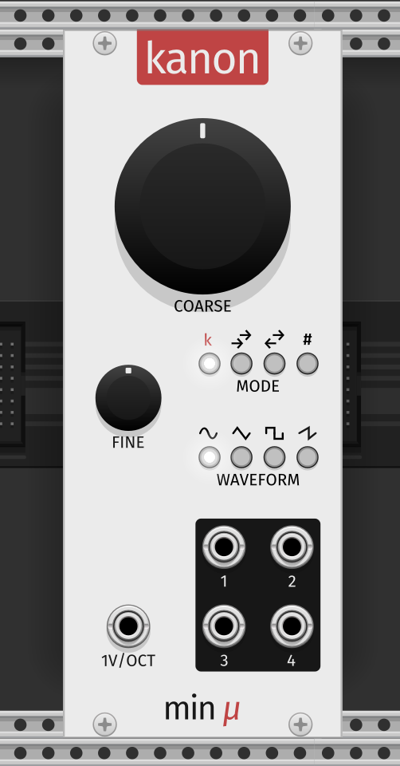
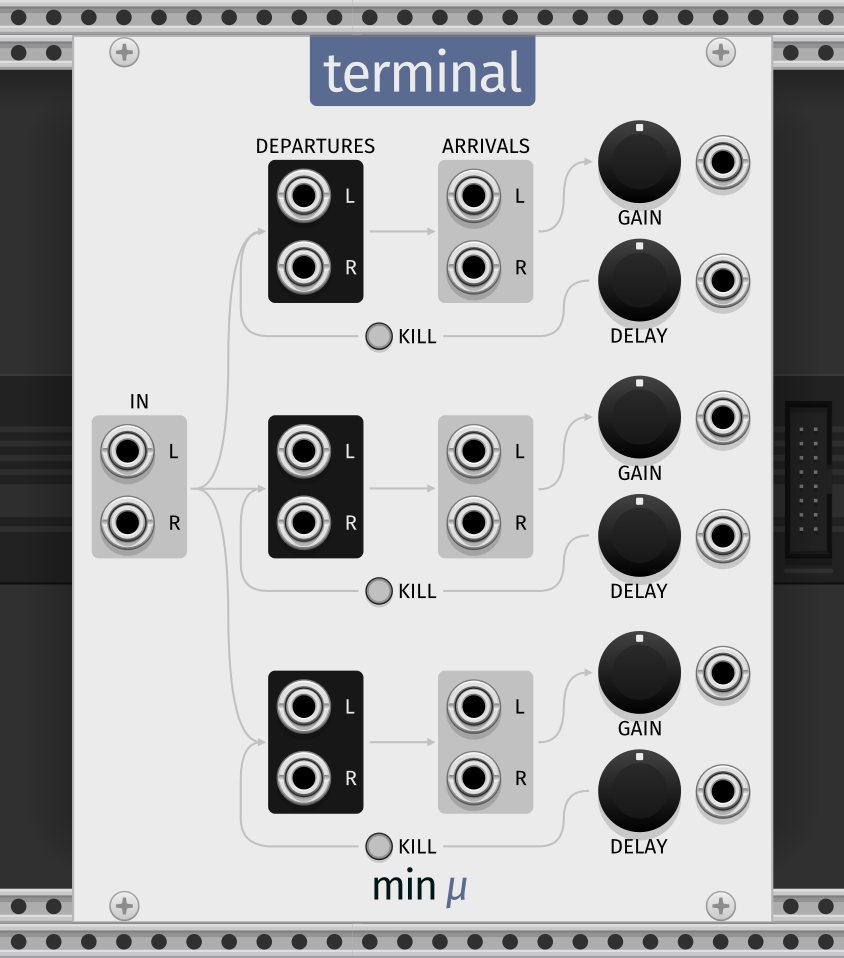

Minimal Friction is a collection of original DSP modules for VCV Rack 2.

# kanon

Kanon is a polyphonic voltage-controlled oscillator. It sports a single 1V/oct input, distributing new pitches to its 4 voices based on a selection of simple algorithms.

## Manual

To switch between waveforms (sine, triangle, square and sawtooth), press their corresponding buttons.

To switch between pitch assignment modes (Kanon, forward-forward, forward-backward and random), press their corresponding buttons.

### Pitch assignment modes

In **Kanon** mode, each next voice is "one pitch change behind" the voice before it.

In **forward-forward** mode, new pitches are always assigned to the next voice advancing forward, except in the case of voice 4, which advances to voice 1; 1-2-3-4-1-2-3-...

In **forward-backward** mode, new pitches are assigned to voices advancing back and forth; 1-2-3-4-3-2-1-2-...

In **random** mode, new pitches are assigned to voices at random.

## Notes
Moving the coarse or fine knobs will not have any influence on pitch assignments.

Feel free to experiment with:
* panning each output differently!
* running each output through a different chain of effects / giving it a different envelope!
* running chord note arpeggios to the 1V/oct input!

# terminal

Terminal is a feedback loop utility module.

## Manual
Introduce your original signal to the feedback loop by connecting it to the stereo "IN" input. From there, 3 channels are at your disposal, all identical in workflow.

Departures and Arrivals are how you can send your signal to and back from an effects chain. The Departure output always consists of the original input signal mixed with the Arrival input signal, multiplied by the value of the gain knob and temporally delayed by the value of the delay knob.

In case the signal achieves undesirably high volume levels (for which there are no internal clippers provided), the "kill" button will clear the delay buffer and reset the Departure output signal.[^1]

You can introduce modulation to each of the channel parameters with their corresponding input ports.

## Notes
* On its own (especially so on paper), Terminal is not super interesting, even though even without any modules between Departures and Arrivals it can already function as a barebones delay effect.

* Even at 100% gain, at sensible delay levels, there should be little to no self-oscillation and clipping. However, especially by introducing non-linearities / additional gain in the feedback loop, the signal can clip quite easily. In general this is viewed as an unwanted effect, but don't be discouraged to use it creatively!

* Given Terminal uses a tapped delay line to delay its Arrival signal before the Departure output, time-stretching and pitch-shifting artifacts can be introduced easily while there is a non-zero signal in the feedback loop by moving the delay knob around.

[^1]: NOTE: Holding down the kill button (or sometimes even just pressing it) will produce a short distorted clicky sound. This is most probably due to the button abruptly crushing the signal to a zero value in one frame. This distorted sound does not make it into your final recording made with the VCV recorder module but it is nonetheless being worked on to remove it entirely.